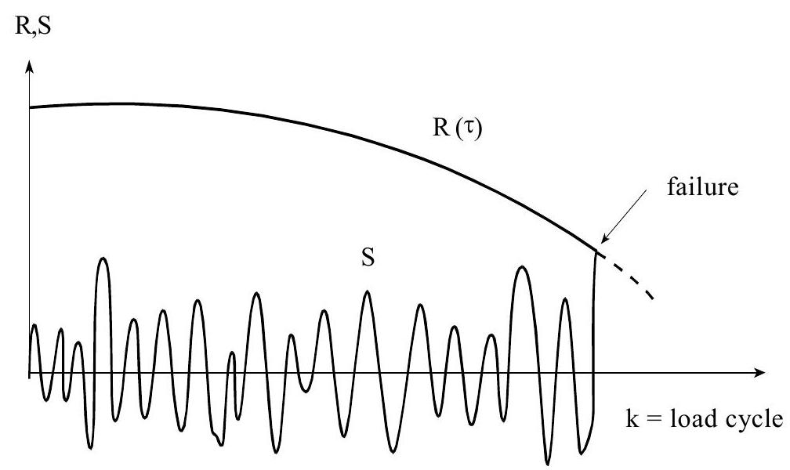

# Annex B: Durability

## Probabilistic Formulations

Loads as well as material properties may vary in time as stationary or non-stationary
processes. Time may also be present in the limit state function as an explicit parameter. As a result, the failure probability of a structure is also time dependent. The general formulation for the failure probability for a period of time t may be presented as:

$$
P_{F}(t)=P[\min g(\mathbf{x}(\tau) ; \tau)<0 \text { for } 0<\tau<t]\tag{B1}
$$

$g(.)$ = limit state function

$\mathbf{x}(\tau)$ = vector of basic variable at time $\tau$

$t$ = period of time under consideration

$\tau$ = time

The failure may be of ULS as well as SLS type. One should keep in mind that also in the case of a non-deteriorating time independent resistance and a stationary loading condition, the failure probability is also time dependent due to the random fluctuations of the load. This, however, is usually not considered as a durability problem.

Given $(B1)$, the conditional failure rate (also referred to as risk functions) at time t may be found as:

$$
r(t)=\frac{P(\text { failure in }[t, t+\Delta t] \mid \text { survival up } t)}{\Delta t}=\frac{p_{F}(t)}{1-P_{F}(t)}
\tag{B2} 
$$

where,

$$
p_F(t) = \frac{dP_F(t)}{dt}\tag{B3}
$$

is the failure time density. For small values of $t$, the failure probability $P_F( t )$ is close to zero, which makes the conditional failure rate and the density almost numerically equal. For durability problems, the conditional failure rate is usually increasing in time. Reliability limits set in section 7 may be related to $(B2)$ or $(B3)$ whichever is appropriate.

If failure of a structural element leads automatically to replacement by a similar element, one may alternatively use the renewal density $h$, defined as;

$$
h(t)=\frac{\sum_{n=1}^{\infty} P(\text { failure of element number } n \text { in }[t, t+\Delta t])}{\Delta t}\tag{B4}
$$

For small $t$ the result will be equal to $(B2)$ and $(B3)$. For large $t$ the value of $h$ will asymptotically lead to $1/μ$ and where $μ$ is the mean time to failure, defined as:

$$
\mu = \int_{0}^{\infty} t\ \ p_{F}(t) dt = \int_{0}^{\infty} (1 - P_{F}(t)) dt\tag{B5}
$$

The calculation procedure for $P_F(t)$ depends on the nature of the limit state function $g(.)$. If $g(.)$ is a smooth monotonically decreasing function not depending explicitly on random process variables, the minimum value is reached at the end of the period, and we simply have:

$$
P_{F}(t)=P[g(\mathbf{x} ; t)<0]\tag{B6}
$$

If $g(.)$ depends on random process variables and, therefore, is not monotonically decreasing, we have a first passage problem. In that case the following upper bound approximation may be useful:

$$
P_F(t)=P_F(0)+\int_{0}^{t}v^{-}(\tau) d \tau \tag{B7}
$$

where $P_F(0)$ is the failure at the start and ${v^{-}}$ the outcrossing rate or unconditional failure rate which is given by:

$$
v^{-}(\tau)=\frac{P[g(\tau)>0 \cap g(\tau+\Delta \tau)<0]}{\Delta \tau} \tag{B8}
$$

In general, the limit state function $g(.)$ may be quite complex due to a combination of
physical, chemical and mechanical processes. Take as an example the deterioration processes due to carbonation and/or chloride ingress of concrete. After some period of time the carbonation or chloride fronts may reach the reinforcement and corrosion may start, resulting eventually in spalling and later even in failure by collapse due to some large mechanical load (see figure B1). Many parameters like the outside climate, the cover of the concrete, the diffusion properties, the corrosion speed and so on may play a role.

Figure B1: Failure due to a combination of physical and chemical processes and a variable mechanical load

## Modelling of deterioration processes

In this Annex we will restrict the discussion to a family of relatively simple damage
accumulation processes that can be described by the following differential equation:

$$
\frac{\mathrm{dy}}{\mathrm{dt}}=\mathrm{y}^{\mathrm{k}}\  \mathrm{h}(\mathrm{z}) \tag{B9}
$$

where

$$
\begin{aligned}
& \mathrm{y}(\mathrm{t})=\text { damage indicator } \\
& \mathrm{z}(\mathrm{t})=\text { random process of disturbances } \\
& \mathrm{h}(\text {.} )=\text { positive definite function of } \mathrm{z} \\
& \mathrm{k}=\text { parameter determining the nature of the process }
\end{aligned}
$$

From $B(9)$ we may arrive at:

$$
\int_{y(0)}^{y(t)} \mathrm{y}^{-\mathrm{k}} \mathrm{dy}=\int_{0}^{t} \mathrm{~h}(\mathrm{z}(\tau)) \mathrm{d} \tau \tag{B10}
$$

Defining $\Psi(\mathrm{y})$ as the integral function of $\mathrm{y}^{-\mathrm{k}}$ and $\chi(\mathrm{t})$ as the right hand side integral of $(B10)$, this can be written as:

$$
\Psi(\mathrm{y}(\mathrm{t}))-\Psi(\mathrm{y}(0))=\chi(\mathrm{t})
$$

If $\mathrm{z}(\mathrm{t})$ is stationary and ergodic, $\chi(\mathrm{t})$ may asymptotically be taken as implying that the damage increases smoothly:

$$
\chi(\mathrm{t})=\mathrm{t}\ \mathrm{E}\{\mathrm{h}(\mathrm{z}(\mathrm{t})\} \tag{B11}
$$

Failure will occur if the damage $y(t)$ exceeds some critical value $y_{cr}$, which leads finally to the following expression for the limit state function:

$$
\mathrm{g}(\mathrm{t})=\Psi\left(\mathrm{y}_{\mathrm{cr}}(\mathrm{t})\right)-\Psi(\mathrm{y}(0))-\chi(\mathrm{t}) \tag{B12}
$$

The critical value $y_{c r}$ may be a constant or time dependent. If $y_{c r}$ is a constant we may use $(B3)$, to find the failure probability. If $y_{\mathrm{cr}}$ is time dependent we have a first passage problem.

$\underline{\text {Characteristic examples}}$

1. &nbsp;&nbsp;*Abrasion / corrosion modelling* 

    Abrasion and/or corrosion mechanisms can be modelled by $\mathrm{k}=0$ and $\mathrm{h}(\mathrm{z})=\mathrm{z}$. In that case $(B9)$ reduces to:

    $$
    \frac{\mathrm{dy}}{\mathrm{dt}}=\mathrm{z}(\mathrm{t})
    $$

    For abrasion or corrosion the damage parameter y corresponds to the thickness of the lost material and z represents the abrasion or corrosion rate. In this case $\Psi$ is simple equal to y itself. Assuming that $\mathrm{z}(\mathrm{t})$ is a stationary and ergodic random process with mean $\mu_{\mathrm{z}}$, we may use $(B12)$ and arrive at:

    $$
    \mathrm{g(t)}=\mathrm{y_{cr}}-\mathrm{y_{o}}-\mathrm{\mu_{z} t}
    $$

    The value $\mathrm{y_{o}}$ may be 0 (or random) and the critical value of $\mathrm{y_{c r}}$ may be related to the load and material strength, for instance:

    $$
    \mathrm{y}_{\mathrm{cr}}=\mathrm{d}_{\mathrm{o}}-\mathrm{S} / \mathrm{f}
    $$

    where $\mathrm{d}_{\mathrm{o}}$ is the original material thickness, $\mathrm{S}$ the load per unit length and $\mathrm{f}$ the material rupture strenght. It can easily be seen that $\mathrm{y}_{\mathrm{cr}}$ is constant in time for a constant load $\mathrm{S}$ and that $\mathrm{y}_{\mathrm{cr}}$ is time dependent for a fluctuating load.

2. &nbsp;&nbsp;*Duration of load*

    We consider again the case $\mathrm{n}=0$ and $\mathrm{h}(\mathrm{z})=\mathrm{z}$. Let now, however, $\mathrm{y}$ represent the relative reduction of the material strength $\mathrm{R}$, that is $\mathrm{R}(\mathrm{t})=\mathrm{R}_{\mathrm{o}}(1-\mathrm{y})$. Let further the disturbance $\mathrm{z}$ be proportional to the mechanical load S. In other words: the presence of a load will lead to a damage or strength reduction, and more if the load is higher. Such a model can be used to represent duration of load effects. If we define $\mathrm{z}=\mathrm{S} / \mathrm{S}_{\mathrm{o}}$, with $\mathrm{S}_{\mathrm{o}}$ some random material parameter, we arrive at:

    $$
    \mathrm{g(t)}=\mathrm{y_{c r}}-\mathrm{y_{o}}-\mathrm{\mu_{S} ~t / S_{o}}
    $$

    Let $\mathrm{y}_{\mathrm{o}}=0$ and let $\mathrm{y}_{\mathrm{cr}}$ correspond to $\mathrm{R}(\mathrm{t})=\mathrm{R}_{\mathrm{o}}\left(1-\mathrm{y}_{\mathrm{cr}}\right)=\mathrm{S}(\mathrm{t})$, we arrive finally at:

    $$
    \mathrm{g(t)}=\mathrm{\left(1-\mu_{S} ~t / S_{o}\right)-S(t) / R_{o}}
    $$

    or equivalently:

    $$
    \mathrm{g(t)=R_{o}\left(1-\mu_{S} ~t / S_{o}\right)-S(t)}
    $$

    Again, if S is a constant load we may use $(B6)$; if not we have a first passage problem. The resulting time dependent strength for a constant load S is presented in figure B2.

    
    Figure B2: Load duration dependent strength under constant load

3. &nbsp;&nbsp;Fatigue Crack Propagation

    Due to load fluctuations some initial small crack in a structure may grow and weaken the cross section. Finally some large load amplitude may lead to collapse of the structural element (see figure B3). The differential equation for the crack growth a is given by:

    $$
    \frac{\mathrm{da}}{\mathrm{dn}}=\mathrm{C} ~\mathrm{Y}(\mathrm{a})\left[\Delta \mathrm{S}(\mathrm{n}) \sqrt{\pi \mathrm{a}}\right]^{\mathrm{m}}
    $$

    Where $\Delta \mathrm{S}$ represents the stress range, $\mathrm{Y}(\mathrm{a})$ represents a geometrical function, $\mathrm{C}$ and $\mathrm{m}$ are material constants and $\mathrm{n}$ is the stress cycle number. Note that in this example the time $\mathrm{t}$ has been replaced by the load cycle number n and that k in $(B5)$ corresponds to m/2. The functions $\Psi$ and $\chi$ are then given by (assuming $\Delta$ S to be stationary and ergodic):

    $$
    \begin{aligned}
    & \Psi=\frac{2}{2-m} \frac{1}{C Y} \pi^{--\mathrm{m} / 2} ~\mathrm{p}^{-\mathrm{m} / 2} ~\mathrm{a}^{1-\mathrm{m} / 2} \\
    \\
    & \chi=\mathrm{nE}\left\{(\Delta \mathrm{S})^{\mathrm{m}_{\mathrm{m}}}\right\}
    \end{aligned}
    $$

    And the limit state function is given by:

    $$
    \mathrm{g}(\mathrm{t})=\Psi\left(\mathrm{a}_{\mathrm{cr}}\right)-\Psi\left(\mathrm{a}_{0}\right)-\chi
    $$

    where $\mathrm{a}_{0}$ is the initial crack length and $\mathrm{a}_{\mathrm{cr}}$ the critical crack length, which again may be time dependent or time independent. In the fist case $(B6)$ may be used, in the second case we have a first passage problem.

    Alternatively, one may formulate the limit state function in the crack domain:

    $$
    \mathrm{g}(\mathrm{t})=\mathrm{a}_{\mathrm{cr}}-\mathrm{a}(\mathrm{n}) \quad \quad \text { with } ~\mathrm{a(n)} = \left\lbrace {a_o}^{1-m/2} + \frac{2}{2-m} C~Y \pi^{m/2}~nE \left\lbrace \Delta s^m \right\rbrace \right\rbrace
    $$

    or in the time domain:

    $$
    \mathrm{g}(\mathrm{t})=\mathrm{N} - \mathrm{n} \quad \quad \text{with} ~\mathrm{N}= \frac{\psi(\mathrm{a_{cr}}) -\psi(\mathrm{a_{o}})}{\mathrm{E} \left\lbrace (\Delta \mathrm{S})^\mathrm{m} \right\rbrace}
    $$

    These alternative formulations are fully equivalent to the first one.

    
    Figure B3: Fatigue fracture under cyclic loading

## Effect of inspection

In the case of deteriorating processes it may be uneconomic to design a structure in such a way that the reliability is sufficient for a normal design life of 50 years. In those cases a more economical solution can be obtained by the definition of an inspection scheme. In those cases failure will not occur if the inspection reveals some predefined deterioration criterion and the structure is repaired adequately.

The sequence of events can be represented in an event tree as indicated in Figure $B4$. Let the first inspection $I_{i}$ be planned at time $t_{i}$. In that case we may have three possibilities.

1) a failure occurs before $t_{i}$ (branche $F$ )
2) the inspection detects a serious defect and repair is necessary (branche R)
3) no serious defect is detected and a next inspection at $t=t_{2}$ is planned

If the structure is repaired, one may usually assume that all variables are reset to the initial situation. From every event $\mathrm{R}$ then a new event tree of the same type as the one in figure $B4$ is started.

For reasons of simplicity we will start by having one inspection only. Using the total probability theorem, the probability of failure for a period t may then formally be written as:

$$
\mathrm{P_{F}}(\mathrm{t})=\mathrm{P}\left[\mathrm{F} \mid \mathrm{Z_{i}}>0\right] ~\mathrm{P}(\mathrm{Z_{i}}>0) + \mathrm{P}\left[\mathrm{F} \mid \mathrm{Z_{i}}<0\right] ~\mathrm{P}(\mathrm{Z_{i}}<0) \tag{B13}
$$

where

$\mathrm{F} \quad=$ failure

$\mathrm{Z}_{\mathrm{i}} \quad=$ inspection result of inspection at time $\mathrm{t}_{\mathrm{i}}$ (negative values correspond to the detection of damage)

If we assume that in the case of a serious damage revealed at the inspection (that is $Z<0$ ) the structure will be repaired adequately, $(B13)$ may be reduced to (replacing $\mathrm{F}$ by $\min _{\tau} \mathrm{g}(\tau)<0$, where $\mathrm{g}(\mathrm{~})$ is the limit state function and $0<\tau<\mathrm{t})$ :

$$
\mathrm{P_{F}}(\mathrm{t})=\mathrm{P}\left[min_{\tau}~\mathrm{g}(\tau)<0 \mid \mathrm{Z_{i}}>0\right] \mathrm{P}\left(\mathrm{Z_{i}}>0\right)
$$

or simply:

$$
\mathrm{P_{F}}(\mathrm{t})=\mathrm{P}\left[min_{\tau}~\mathrm{g}(\tau)<0 ~\cap~ \mathrm{Z}_{\mathrm{i}}>0\right]
$$

If more inspections in fixed intervals are present we arrive at:

$$
\mathrm{P_{F}}(\mathrm{t})=\mathrm{P}\left[\mathrm{min}_{\tau}~\mathrm{g}(\mathbf{x}(\tau) ;\tau)<0~~\cap~~\left\lbrace \cap \mathrm{Z_i} (\mathbf{x}(\mathrm{t_i});\mathrm{t_i})\right\rbrace > 0 ~\text{for}~0<\tau<\mathrm{t} \right] \tag{B14}
$$

$\mathrm{t}_{\mathrm{i}}=$ time of inspection; only inspections with $\mathrm{t}_{\mathrm{i}}<\tau$ are relevant

Note: whether or not an inspection is planned, of course, is a matter of economy.

## Example

Figure $B5$ clarifies formula $(B14)$ for the case of fatigue. As discussed before, the g-function for the situation at the load cycle at time $\tau$ is given by:

$$
g=a_{c r}-a(t)
$$

Let the crack $a(\tau)$ be monitored by a yearly inspection. If the measured crack $a_{m}$ is larger that some limit $\mathrm{a}_{\mathrm{lim}}$ the structure will be adequately repaired. An inspection failure may then be modelled as $\mathrm{Z}_{\text {ins }}<0$ with:

$$
\mathrm{Z}_{\text {ins }}=\mathrm{a}_{\lim }-\mathrm{a}_{\mathrm{m}}\left(\mathrm{t}_{\mathrm{i}}\right)
$$

In present practice $a_{\lim }$ usually corresponds to the detection limit and the probability distribution for $\mathrm{a}_{\lim }$ is then equal to the so called POD-curve (probability of detection).

Failure will occur only if the measured value $\mathrm{a}_{\mathrm{m}}\left(\mathrm{t}_{\mathrm{ins}}\right)$ is below the limit value $\mathrm{a}_{\mathrm{lim}}$ at inspection $t_{i}$ but above the $a_{\text {crit }}$ before the next inspection. This way failure probability can be reduced by shorter inspection intervals or by more refined or accurate inspection techniques.

Note that an implication of this method is that these Probability of Detection curves (POD curves) and measurement accuracies must be known to the designer in order to decide whether or not a certain structure meets the reliability requirements. Note further that the probability of repair is given by:

$$
\mathrm{P}=\mathrm{P}\left[\mathrm{Z}_{\text {ins }}<0\right]
$$

Repair may be considered like some serviceability limit state. The designer should also make sure that the probability of repair is below some economic limit value.

  
Figure B4: Event tree representation of an inspected component: $R=$ Repair or maintenance action; $F=$ Failure, $I_{i}=$ Inspection at time $t_{i}$

  
Figure B5: Fatigue failure in the interval $t_{i}, t_{i}+\Delta t_{i}$ with $a(\tau)<a_{\text {lim }}$ at the beginning of the interval.

