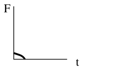
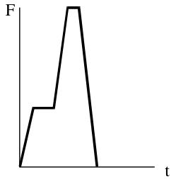
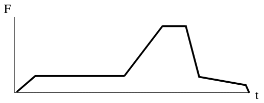

# Impact Load

**List of symbols:**

$a=$ deceleration

$A_{b}=$ the area of the building including the shadow area

$d =$ distance from the structural element to the road

$f_{s}(y)=$ distribution of initial object position in $y$ direction

$F_{c}(x)=$ static compression strength at a distance $x$ from the nose

$k=$ stiffness

$m=$ mass

$m^{\prime}(x)=$ mass per unit length

$n=$ number of vehicles, ships or planes per time unit

$n(t)=$ number of moving objects per time unit (traffic intensity)

$P_{a}=$ the probability that a collision is avoided by human intervention.

$P_{fq}(xy)=$ the probability of structural failure given a mechanical or human failure on the ship, vehicle, etc. at point $(x, y)$.

$r=d / \sin \alpha=$ the distance from "leaving point" to "impact point"

$R=$ radius of airport influence circle

$T=$ period of time under consideration

$v_{c}=$ the object velocity at impact

$v_{c}(t)=$ velocity of the crashed part

$v_{c}(xy)=$ object velocity at impact, given initial failure at point $(x, y)$

$v_{o}=$ velocity of the vehicle when leaving the track

$x, y=$ coordinate system;

$\alpha=$ angle between collision course and track direction

$\Lambda(r)=$ collision rate for crash at distance $r$ from the airport with $r<R$

$\lambda(x, t)=$ failure intensity as a function of the coordinate $x$ and the time $t$.

(section-2.18.1)=
## Basic Model for Impact Loading

### Introduction

The basic model for impact loading constitutes of (see {numref}`fig-probabilistic-collision-model`):

- potentially colliding objects (vehicles, ships, airplanes) that have an intended course, which may be the centre line of a traffic lane, a shipping lane or an air corridor; the moving object will normally have some distance to this centre line;
- the occurrence of a human or mechanical failure that may lead to a deviation of the intended course; these occurences are described by a homogeneous Poisson process;
- the course of the object after the initial failure, which depend on both object properties and environment;
- the mechanical impact between object and structure, where the kinetic energy of the colliding object is partly transferred into elastic-plastic deformation or fracture of the structural elements in both the building structure and the colliding object.

```{figure} ../part-02/images/fig-probabilistic-collision-model.jpg 
:name: fig-probabilistic-collision-model

Probabilistic collision model
```

(section-2.18.1.2)=
### Failure probability

The probability that a single object, moving in x-direction, suffers from a human or mechanical failure in the square [dx, dy] (see {numref}`fig-probabilistic-collision-model`) and causes collapse at some structure is given by:

```{math}
P_{fq}(x, y)~f_{s}(y)~dy~\lambda(x, t)~d x
```

where:

$f_{s}(y)=$ distribution of initial object position in y direction (see {numref}`fig-probabilistic-collision-model`)

$P_{fq}(xy)=$ the probability of structural failure given a mechanical or human failure on the ship, vehicle, etc. at point $(x, y)$.

$x, y=$ coordinate system; the $x$ coordinate follows the centre line of the traffic lane, while the $y$ coordinate represents the (horizontal) distance of the object to the centre; the structure that potentially could be hit, is located at the point with coordinates $x=0$ and $y=d$.

$\lambda(x, t)=$ failure intensity as a function of the coordinate $x$ and the time $t$. The length dependency expresses the variability in circumstances along the centre line (for instance curved versus straight trajectories). The time dependency indicates differences in summer and winter, day and night, etc. Note that although $\lambda(x, t)$ is a function of $x$ and $t$, its dimension is [1/Length].

The probability of structural failure for a period $T$ can then be presented as:

```{math}
:label: eq-impact-2.18.1
P_{f}(T)=1-\exp \left\lbrace-\iiint n(t) \lambda(x, t) P_{f q}(x y) f_{s}(y) d x~d y~d t\right\rbrace
```

or for small probability and constant $n$ and $\lambda$ :

```{math}
:label: eq-impact-2.18.2
P_{f}(T)=n T \lambda \iint{P_{f q}}(x, y) f_{S}(y) d y d x
```

where:

$T \quad=\quad$ period under consideration

$n(t) \quad=\quad$ number of moving objects per time unit (traffic intensity)

### Distribution function for the impact load

In principle, impact is an interaction phenomenon between the object and the structure. It is not possible to formulate a separate action and a separate resistance function. However, an upper bound for the impact load can be found using the "rigid structure" assumption. If the colliding object is modelled as an elastic single degree of freedom system, with equivalent stiffness $k$ and mass $m$, the maximum possible resulting interaction force equals:

```{math}
:label: eq-impact-2.18.3
F_{c}=v_{c} \sqrt{ (km)}
```

$v_{c}=$ the object velocity at impact

Note that {eq}`eq-impact-2.18.3` gives the maximum for the external load; dynamic effects within the structure still need to be considered. Note further that simple upperbounds also may be obtained if the structure and or the object behaves plastic: $F_{c}=\min \left[F_{y s}, F_{y o}\right]$ where $F_{y s}=$ yield force of the structure and $F_{y o}=$ yield force of the object; the duration of this load is $\Delta_{t}=mv_{c} / F_{c}$.

Based on formulation {eq}`eq-impact-2.18.3` the distribution function for the load $F_{c}$ can be found: 

```{math}
:label: eq-impact-2.18.4
P\left\{F_{C}<X\right\}=1-\exp \left\lbrace-\iiint n \lambda~P\left[v_{C}(xy) \sqrt{km}>X\right] f_{S}(y) dxdydt\right\rbrace
```

$v_{c}(xy)=$ object velocity at impact, given initial failure at point $(x, y)$

For small probabilities:

```{math}
:label: eq-impact-2.18.5
P\left\{F_{C}>X\right\}=P_{f}(T)=nT \lambda \iint P\left[v_{c} \sqrt{km}>X\right] f_{S}(y) dydx
```

For the designation of the variables, see [clause 18.1.2](section-2.18.1.2).

## Impact from vehicles

(section-2.18.2.1)=
### Distribution of impact force

Consider a structural element in the vicinity of a road or track. Impact will occur if some vehicle, travelling over the track, leaves its intended course at some critical place with sufficient speed (see {numref}`fig-illustration-of-impact-load-from-collision`).

```{figure} ../part-02/images/illustration-of-impact-load-from-collision.jpg 
:name: fig-illustration-of-impact-load-from-collision

A vehicle leaves the intended course at point $Q$ with velocity $v_{0}$ and angle $a$. A structural element at distance $r$ is hit with velocity $v_{r}$
```

The collision force probability distribution based on {eq}`eq-impact-2.18.5`, neglecting the variability in y-direction is given by:

```{math}
:label: eq-impact-2.18.6
P\left(F_{c}>X\right)=n T \lambda \Delta xP\left[\sqrt{ }\left\lbrace m k\left(v_{o}^{2}-2 ar\right)\right\rbrace >X\right]
```

$n =$ number of vehicles per time unit

$T=$ period of time under consideration

$\lambda=$ probability of a vehicle leaving the road per unit length of track

$\Delta x =$ part of the road from where collisions may be expected

$v_{o} =$ velocity of the vehicle when leaving the track

$a$ = deceleration 

$r =d / \sin \alpha=$ the distance from "leaving point" to "impact point"

$d=$ distance from the structural element to the road

$\alpha \quad=$ angle between collision course and track direction

$\lambda \Delta x$ is the probability that a passing vehicle leaves the road at the interval $\Delta x$, which is approximated by:

```{math}
:label: eq-impact-2.18.7
\Delta x=b / \sin \mu(\alpha)
```

The value of $b$ depends on the structural dimensions. However, for small objects such as columns a minimum value of b follows from the width of the vehicle, so $b > 2.5 m$.

Numerical values and probabilistic models can be found in {numref}`table-Numerical-values-for-vehicle-impact`.

```{table} Numerical values for vehicle impact
:name: table-Numerical-values-for-vehicle-impact
| variable | designation | type | mean | stand dev |
| :---: | :--- | :---: | :--- | :--- |
| $\lambda$ | accident rate | deterministic | $10^{-10} ~m^{-1}$ | - |
| $\alpha$ | angle of collision course | rayleigh | $10^{\circ}$ | $10^{\circ}$ |
| $v$ | vehicle velocity <br> $\quad$- motorway <br> $\quad$-urban area <br> $\quad$- court yard <br> $\quad$- parking garage | <br> lognormal <br> lognormal  <br> lognormal <br> lognormal | <br> 80 km/hr <br> 40 <br> 15 <br> 10 | <br> 10 km/hr <br> 7 <br> 6 <br> 5 |
| a | deceleration | lognormal | 4 m$^{2}$/s | 1.3 m$^{2}$/s |
| m | vehicle mass <br> $\quad$- truck <br>  $\quad$- car | <br> normal <br> normal | <br> 20,000 kg* <br> 1500 kg | <br> 12,000 kg* <br> 400 kg |
| k | vehicle stiffness | lognormal | 300 kN\m | 60 kN\m |
```

*Combined with $F = k√mv$ these estimates are quite conservative. One might consider possible reductions due to transformation of energy into rotational movements, etc. e.g. by the concept of “effective mass”

### Specifications of impact force

The collission force is a horizontal force; only the force component perpendicular to the structural surface needs to be considered.

The collision force for passenger cars affects the structure at $0.5 ~m$ above the level of the driving surface; for trucks the collision force affects it at $1.25 ~m$ above the level of the driving surface. The force application area is $0.25 ~m$ (height) times $1.50 ~m$ (width). 

For impact loads on horizontal structural elements above traffic lanes the following rules hold (see {numref}`fig-impact-loads-on-horizontal-structural-elements-above-traffic-lanes`):

1) on vertical surfaces the impact actions follow from [18.2.1.](section-2.18.2.1) and the height reduction as specified at (3).

2) on horizontal lower side surfaces upward inclination of 10% should be considered. The force application area is 0.25 m (height) times 0.25 m (width).

3) for free heights $h$ larger 6.0 m the forces are equal to zero; for free heights between 4.0 m and 6.0 m a linear interpolation should be used

```{figure} ../part-02/images/fig-impact-loads-on-horizontal-structural-elements-above-traffic-lanes.jpg 
:name: fig-impact-loads-on-horizontal-structural-elements-above-traffic-lanes

Impact loads on horizontal structural elements above traffic lanes
```

## Impact from ships

### Distribution of impact force

A co-ordinate system $(x,y)$ is introduced as indicated in {numref}`fig-ingredients-for-a-ship-collision-model`. The $x$ coordinate follows the centre line of the traffic lane, while the The $y$ co-ordinate represents the (horizontal) distance of the ship to the centre. The structure that potentially could be hit is located at the point with co-ordinates $x=0$ and $y=d$.

```{figure} ../part-02/images/ingredients-for-a-ship-collision-model.jpg 
:name: fig-ingredients-for-a-ship-collision-model

Ingredients for a ship collision model 
```

Ship impact may be the result of:

1) either a ship being on collision course, while no avoidance action is taken

2) a mechanical or human failure leading to a change of course.

In case (1) a ship is on collision course, which is not corrected due to inattendance, bad visibility, old cards and so on. In case (2) the orginal course is correct, but changed, due to e.g. rudder problems or misjudgement.

Both origins (1) and (2) are present in the following model which is a modification of [18.1.](section-2.18.1):

```{math}
:label: eq-impact-2.18.8
\begin{aligned}
& P(F>X) \quad=nT P_{na} \iint_{\Delta y} P\left[v_{C}(x, y) \sqrt{km}>X\right] f_{S}(y) dx dy \\
& +nT \lambda \iint_{-\infty}^{+\infty} P\left[v_{C}(x, y) \sqrt{km}>X\right] f_{S}(y) dx dy
\end{aligned}
```

$T=$ period of time under consideration

$n=$ number of ships per time unit (traffic intensity)

$\lambda=$ probability of a failure per unit travelling distance

$v(x, y)=$ impact velocity of ship, given error at point $(x, y)$

$k=$ stiffness of the ship

$m=$ mass of the ship

$f_{s}(y)=$ distribution of initial ship position in $y$ direction

$P_{n}=$ the probability that a collision is not avoided by human intervention, given collision course

$\Delta y=$ values of $y$ coinciding with a collision course

For the evaluation in practical cases, it may be necessary to evaluate {eq}`eq-impact-2.18.8` for various ship types and traffic lanes, and add the results in a proper way at the end of the analysis. 

{numref}`table-Numerical-values-for-ship-impact` gives a number of standard ship characteristics and velocities that could be chosen by the designer.

```{table} Numerical values for ship impact
:name: table-Numerical-values-for-ship-impact
| variable | designation | type | mean | standard dev |
| :--- | :--- | :--- | :--- | :--- |
| $P_{na}$ | avoidance <br> probability <br> $\quad$- small <br> $\quad$- medium <br> $\quad$- large  <br> $\quad$- very large | - | <br> <br> 0.045 <br> 0.003 <br> 0.002 <br> 0.001 | - |
| $\lambda$ | failure rate | - | 10$^{-6}$ km$^{-1}$ | - |
| v | velocity <br> $\quad$- harbour <br> $\quad$- canal <br> $\quad$- sea | <br> lognormal <br> lognormal <br> lognormal | <br> 1.5 m\s <br> 3 <br> 6 | <br> 0.5 m\s <br> 1.0 <br> 1.5 |
| m | mass <br> $\quad$- small <br> $\quad$- medium <br> $\quad$- large <br> $\quad$- very large | <br> lognormal <br> lognormal <br> lognormal <br> lognormal | <br> 1000 ton <br> 4000 <br> 20000 <br> 200000 | <br> 2000 ton <br> 8000 <br> 40000 <br> 200000 |
| k | equivalent stiffness | lognormal | 15 MN/m | 3 MN/m |
```

### Specifications of impact force

Bow, stern and broad side impact shall be considered where relevant; for side and stern impact the design impact velocities may be reduced.

Bow impact shall be considered for the main sail direction with a maximum deviation of $30^{\circ}$.

If a wall structure is hit under an angle a, the following forces should be considered:

- perpendicular to the wall:
$F_{y}=F \sin \alpha$
- in wall direction:
$F_{x}=fF \sin \alpha$

where $F$ is the collision force at $\alpha=90^{\circ}$ and $f=0.3$ is the friction coefficient.

Impact is to be considered as a free horizontal force; the point of impact depends on the geomertry of the structure and the size of the vessel. As a guideline one could take the most unfavourable point ranging from $0.1 ~L$ below to $0.1 ~L$ above the design water level. The impact area is $0.05 ~L * 0.1 ~L$ unless the stuctural element is smaller.

$L$ is the typical ship length ($L=15,40,100$ and $300 ~m$ for respectively small, medium, large and very large ship size).

The forces on the superstructure of the bridge depend on the height of the bridge and the type of ships to be expected. In general the force on the superstructure of the bridge will be limited by the yield strenght of the ships superstructure. A maximum of $10000 kN$ for large and very large ships and $3000 kN$ for small and medium ships can be taken as a guideline averages.

## Impact from airplanes

### Distribution of impact force

The probability of a structure being hit by an airplane is very small. Only for exceptional structures like nuclear power plants, where the consequences of failure may be very large, is it mandatory to account for aircraft impact during design.

For $\underline{\text{air corridors}}$, using {eq}`eq-impact-2.18.3` and for small probabilities:

```{math}
:label: eq-impact-2.18.9
P\left(F_{C}>X\right)=n T \lambda A_{b} P_{na} P\left(F_{C}>X \mid impact\right) f_{S}(y)
```

$n=$ number of planes passing per time unit through an air corridor (traffic intensity)

$T=$ time period of interest (for instance reference period)

$\lambda=$ probability of a crash per unit distance of flying

$f_{s}(y)=$ distribution of ground impact perpendicular to the corridor direction, given a crash

$A_{b}=$ the area of the building including the shadow area

$P_{\text {na }}=$ probability of not avoiding a collision, given an airplane on collision course

The area $A_{b}$ is the area of the building itself, enlarged by a so called shadow area (see {numref}`fig-strike-area-for-airplane-crash`). The strike angle $\alpha$ is random.

For the $\underline{\text{vicinity of an airport}}$ (at a distance $r$) the impact force distribution is based on:

```{math}
:label: eq-impact-2.18.10
P\left(F_{C}>X\right)=\operatorname{nTP}_{na} \Lambda(r) A_{b} P\left\lbrace F_{C}>X \mid \text{impact}\right\rbrace
```

```{math}
:label: eq-impact-2.18.11
\Lambda(r)=\frac{\overline{\Lambda} R}{2 r}
```

$\overline{\Lambda}=$ average air plane collision rate for a circular area with radius $R$ = 8 km

$\Lambda(r)=$ collision rate for crash at distance $r$ from the airport with $r<R$

$n=$ number of planes approaching the airport per windtunnel

$R=$ radius of airport influence circle

$r=$ distance to the airport

Numerical values are presented in {numref}`table-Numerical-values-for-the-air-plane-impact-model`

```{figure} ../part-02/images/fig-strike-area-for-airplane-crash.jpg 
:name: fig-strike-area-for-airplane-crash

Strike area $A_{b}$ for an airplane crash
```

For airplanes the impact model {eq}`eq-impact-2.18.3` is not sufficient. A better model is given by:

```{math}
:label: eq-impact-2.18.12
F_{C}(t)=F_{C}(\xi)+m^{\prime}(\xi) v_{c}^{2}(t)
```

```{math}
:label: eq-impact-2.18.13
\xi=\int_{0}^{t} v_{c}(\tau) d \tau
```

$F_{c}(x)=$ static compression strength at a distance $x$ from the nose

$m^{\prime}(x)=$ mass per unit length at a distance $x$ from the nose

$v_{c}(t)=$ velocity of the crashed part of the plane at time $t$

Sometimes $v_{c}(t)$ is taken as constant and equal to $v_{r}$ for further simplification. Results from calculations based on this model can be found in {numref}`table-Impact-characteristics-for-various-aircrafts`.

It is recommended to make the analysis for each type of aircraft (small, large, civil, military) separately and add the results afterwards.

```{table} Numerical values for the air plane impact model
:name: table-Numerical-values-for-the-air-plane-impact-model
| | | |
| :--- | :--- | :--- |
| $\lambda$ | Crash rate <br> $\quad$- military plane <br> $\quad$- civil plane | <br> $10^{-8}$ km$^{-1}$ <br> $10^{-9}$ km$^{-1}$ |
| $\Lambda$ | Average collission rate for airport area <br> $\quad$- small planes (<6 ton) <br> $\quad$- large planes (>6 ton) | <br> $10^{-4}$ yr$^{-1}$ km$^{-1}$ <br> 4 . $10^{-5}$ yr$^{-1}$ km$^{-1}$ |
| $R$ | Radius of aiport influence circle | 8 km |
| $\alpha$ | Strike angle | mean 10$^{\circ}$ <br> standard deviation  10$^{\circ}$ <br> Rayleigh Distribution |
```

```{table} Impact characteristics for various aircrafts (perpendicular on immovable walls)
:name: table-Impact-characteristics-for-various-aircrafts
| Type | t [ms] | F [MN] |  |
| :--- | :---: | :---: | :--- |
| Cessna 210 A <br> m = 1.7 ton <br> v = 100 m/s <br> A = 7 m$^2$ <br> engine m = 0.2 ton <br> $\quad \quad \quad$A =  0.5 m$^2$| 0 <br> 3 <br> 6 <br> 18 <br> 18 <br> $\quad$ | 0 <br> 7 <br> 7 <br> 4 <br> 4 <br> $\quad$ |  |
| Lear Jet 23 A <br> m = 5.7 ton <br> v = 100 m/s <br> A = 12 m$^2$ <br> <br> <br> <br> | 0 <br> 20 <br> 35 <br> 50 <br> 70 <br> 80 <br> 100 | 0 <br> 2 <br> 6 <br> 6 <br> 12 <br> 20 <br> 0 |  |
| MRCA (Multi Role Combat) <br> m = 25 ton <br> v = 215 m/s <br> 4 = 7 m$^2$ <br> engine m = 1.2 ton <br> $\quad \quad \quad$A =  0.5 m$^2$ | 0 <br> 10 <br> 30 <br> 40 <br> 50 <br> 701 | 0 <br> 55 <br> 55 <br> 154 <br> 154 <br> 0 |  |
| Boeing 707-320 <br> m = 90 ton <br> v = 100 m/s <br> A = 36 m$^2$ <br> <br> <br> <br> <br>| 0 <br> 30 <br> 150 <br> 200 <br> 230 <br> 250 <br> 320 <br> 330 | 0 <br> 20 <br> 20 <br> 90 <br> 90 <br> 20 <br> 10 <br> 0 |  |
```
$A$ = cross sectional area of the plane or engine

$m = $ mass

$v_{r} = $ velocity at impact

