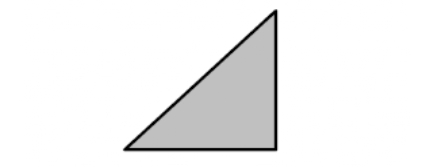
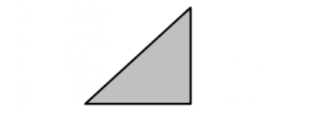

# Masonry Properties

**List of symbols:**

$\begin{array}{ll}f_{m}  & = \text { compressive strength of masonry } \\
f_{m, l} & = \text { compressive strength of masonry in longitudinal direction } \\
f_{b} & = \text { compressive strength of unit } \\
f_{\text {mo }} & = \text { compressive strength of mortar } \\
f_{b t, l} & = \text { tensile strength of units in longitudinal direction of the units } \\
f_{b t, s}  & = \text { splitting tensile strength of units } \\
f_{t}  & = \text { tensile strength of masonry } \\
f_{v}  & = \text { cohesion } \\
a  & = \text { coefficient } \\
b  & = \text { coefficient } \\
c  & = \text { coefficient } \\
c_{1} & = \text { ratio } E_{m} / f_{m} \\
c_{2} & = \text { ratio } f_{b t, l} / f_{b} \\
c_{3} & = \text { ratio } f_{b t, s} / f_{b} \\
Y_{1} & = \text { a log-normal variable taking into account uncertainties in the calculation of the compressive strength of masonry } \\
Y_{2} & = \text { a log-normal variable taking into account uncertainties in the calculation of the modulus of elasticity } \\
Y_{3} & = \text { a log-normal variable taking into account uncertainties in the calculation of the tensile strength of masonry } \\
Y_{4} & = \text { a log-normal variable taking into account uncertainties in the calculation of the tensile strength of unit } \\
Y_{5} & = \text { a log-normal variable taking into account uncertainties in the calculation of the cohesion } \\
Y_{6} & = \text { a log-normal variable taking into account uncertainties in the calculation of the friction coefficient } \\
\varepsilon  & = \text { strain } \\
\mathcal{E}_{u} & = \text { ultimate strain } \\
E_{0} & = \text { modulus of elasticity } \\
\mu & = \text { friction coefficient } \\
\sigma & = \text { stress } \\
h_{k}  & = \text { buckling length of wall } \\
t & = \text { thickness of wall }\end{array}$

**Abbreviations:**

$\begin{array}{ll}\text { LC } & \quad \text { Lightweight concrete } \\   
\text { NC } & \quad   \text { Normal density concrete } \\   
\text { C }  & \quad   \text { Concrete } \\   
\text { CS } & \quad   \text { Calcium silicate } \\   
\text { AAC } & \quad   \text { Autoclave aerated concrete } \\ 
\text { CB } &  \quad  \text { Clay brick } \\   
\text { GPM } & \quad   \text { General purpose mortar } \\ 
\text { TLM } & \quad   \text { Thin layer mortar }\end{array}$   

## Scope

Masonry is made of units and mortar which show strong regional differences in the material properties and dimensions. Since stochastic treatment of masonry is relatively new, all the values given in the following represent prior values and may be subject to updating techniques. Also, the values (except the values for the compressive strength of masonry) are values derived from tests on single elements. The values might be different for full walls due to spatial variation.

This section especially deals with unreinforced masonry made of artificial units that meet the requirements of the national manufacturing codes. Masonry is widely used as an unreinforced material but in certain countries reinforced solutions are common (e.g. in earthquake regions). For reinforced masonry, additional information is required for the stochastic modelling of the reinforcing steel (s. [chapter 26.](../part-03/static-properties-of-reinforcing-steel.md)).

## Basic Properties

The main property of masonry is the compressive strength $f_{m}$ which is determined on standard test specimens (so called RILEM specimens which are 5 units tall, 2.5 units wide and 1 unit thick) tested according to standard conditions (RILEM TC 76-LUM). Other properties, such as the modulus of elasticity are related to the compressive strength. However, some properties - like the friction coefficient - directly depend on the used type of units and mortar.

Masonry only provides very small tensile strength perpendicular to the bed joints which therefore is often neglected. However, the flexural tensile strength of masonry may have a large effect on the load-carrying capacity of slender walls and should be considered in a probabilistic analysis. The flexural tensile strength parallel to the bed joints often has to be taken into account if walls are subjected to lateral loads (wind, earth pressure).

The shear capacity of masonry walls depends on the tensile strength of the units (shear failure) and on the cohesion between units and mortar (sliding failure). Additionally, the friction coefficient is influencing the tensile strength parallel to the bed joints and the sliding shear capacity.

### Compressive strength of masonry

The compressive strength of masonry depends on the compressive strength of units and mortar. The following equation {eq}`eq-masonry-1` is recommended for the determination of the compressive strength.

```{math}
:label: eq-masonry-1
f_{m}=K \cdot f_{b}^{\alpha} \cdot f_{m o}^{\beta} \qquad\left(f_{b} \text { and } f_{m} \text { represent mean values }\right)
```

In case of thin layer mortar, the mortar quality does not influence the compressive strength of masonry and so the relationship becomes

```{math}
:label: eq-masonry-2
f_{m}=K \cdot f_{b}^{\alpha} \qquad\left(f_{b} \text { represents the mean value }\right)
```

with

$f_{m} =$ mean of the compressive strength of masonry

$f_{b} =$ mean of the compressive strength of units in vertical direction

$f_{\text {mo }}=$ mean of the compressive strength of mortar

$K=$ coefficient, see {numref}`table-parameters-K-α-β-for-the-determination-of-the-compressive-strength-of-masonry`

$\alpha=$ coefficient, see {numref}`table-parameters-K-α-β-for-the-determination-of-the-compressive-strength-of-masonry`

$\beta =$ coefficient, see {numref}`table-parameters-K-α-β-for-the-determination-of-the-compressive-strength-of-masonry`

The slenderness $\lambda=h_{k} / t$ plays an important role in the determination of the masonry compressive strength. To transform the obtained compressive strength to the reference slenderness of $\lambda=5$, the following equation can be used.

```{math}
:label: eq-masonry-3
k_{\lambda=5}=\left(0.966+0.00136 \cdot \lambda_{\text {specimen }}^{2}\right)
```

The parameters $K, \alpha$, and $\beta$ are prior values and should be updated by use of test data. The compressive strength of masonry $f_{m, l}$ in longitudinal direction (only for masonry with grouted head joints) is thought to be 50% of the masonry compressive strength $f_{m}$ according to equation {eq}`eq-masonry-1` and {eq}`eq-masonry-2`.

```{table} Parameters K, α, β for the determination of the compressive strength of masonry according to [[1]](masonry-references) for a slenderness of the specimen of λ = 10
:name: table-parameters-K-α-β-for-the-determination-of-the-compressive-strength-of-masonry
|  | Masonry |  | $n$ | $K$ | $\alpha$ | $\beta$ |
| :---: | :---: | :---: | :---: | :---: | :---: | :---: |
|  | Units |  |  |  |  |  |
| Material | Unit type | Mortar |  |  |  |  |
| LC | <br> full and hollow <br> blocks | TLM <br> LWM <br> GPM | 35 <br> 80 <br> 167 | 0.85 <br> 0.85 <br> 0.85 | 0.84 <br> 0.58 <br> 0.73 | 0 <br> 0.15 <br> 0.07 |
| LC | full blocks | LWM | 21 | 0.70 | 0.66 | 0.16 |
| LC | hollow blocks | LWM | 59 | 0.86 | 0.57 | 0.14 |
| LC | full blocks | GPM | 61 | 0.85 | 0.72 | 0.09 |
| LC | hollow blocks | GPM | 106 | 0.89 | 0.69 | 0.05 |
| LC | full blocks | TLM | 20 | 0.63 | 1.00 | 0 |
| AAC | regular unit | NM | 140 | 0.98 | 0.68 | 0.02 |
| AAC | regular unit | NM | 140 | 0.99 | 0.69 | 0 |
| AAC | regular unit | LM | 17 | 0.80 | 0.64 | 0.09 |
| AAC | regular unit | LM | 17 | 0.99 | 0.64 | 0 |
| AAC | plane element | DM | 162 | 0.63 | 1.00 | 0 |
| AAC | plane element | DM | 162 | 0.83 | 0.86 | 0 |
| NC | hollow block | GPM | 15 | 0.03 | 1.82 | 0.23 |
| CS | full | GPM | 276 | 0.70 | 0.74 | 0.21 |
| CS | block | GPM | 24 | 0.44 | 0.92 | 0.17 |
| CS | perforated | GPM | 108 | 0.85 | 0.57 | 0.20 |
| CS | hollow | GPM | 70 | 0.99 | 0.64 | 0.05 |
| CS | plane elements | TLM | 66 | 0.53 | 1.00 | 0 |
| CB | full | GPM | 55 | 0.73 | 0.73 | 0.16 |
| CB | perforated | GPM | 342 | 0.55 | 0.56 | 0.46 |
| CB | lightweight <br> perforated | TLM | 9 | 0.75 | 0.72 | 0 |
| CB | lightweight <br> perforated | LWM 21 | 17 | 0.67 | 0.50 | 0.05 |
| CB | lightweight <br> perforated | LWM 21 | 17 | 0.18 | 1.00 | 0 |
| CB | lightweight <br> perforated | LWM 36 | 13 | 0.47 | 0.82 | 0 |
| CB | lightweight <br> perforated | LWM 36 | 13 | 0.28 | 1.00 | 0 |
| CB | lightweight <br> perforated | GPM | 28 | 0.26 | 0.82 | 0.42 |
```

### Modulus of elasticity

The modulus of elasticity is commonly related to the compressive strength of masonry. For the stochastic modelling, the following equation {eq}`eq-masonry-4` is recommended.

```{math}
:label: eq-masonry-4
E_{m}=c_{1} \cdot f_{m}
```

with

$E_{m}=$ mean of modulus of elasticity of masonry

$c_{1}=$ ratio $E_{m} / f_{m}$ according to {numref}`table-values-for-c1`

The parameter $c_{1}$ is a prior value and should be updated by use of test data.

```{table} Values for $c_{1}$ according to [[1]](masonry-references)
:name: table-values-for-c1
| Type of unit | Mortar | $\boldsymbol{c}_{\boldsymbol{1}}$ <br> [-] |
| :---: | :---: | :---: |
| CS | GPM, TLM | 500 |
| AAC | GPM | 520 |
| AAC | TLM | 560 |
| LC | GPM | 1040 |
| LC | TLM | 930 |
| Perforated clay bricks | GPM | 1170 |
| Perforated clay bricks | TLM | 1190 |
| Perforated clay bricks | lightweight | 1480 |
```

### Flexural tensile strength of masonry

The flexural tensile strength of masonry can be divided into flexural tensile strength perpendicular and parallel to the bed joints. It is a strongly scattering property and depends mainly on the mortar. The execution of the head joints (unfilled (uf) or filled (f)) was also found to have small influence. Since only thin layer mortar is providing sufficiently reliable cohesion, tests of the flexural tensile strength were more or less only conducted on masonry with TLM. Values of the flexural tensile strength for masonry with TLM can be found in {numref}`table-flexural-tensile-strength-of-masonry-parallel-to-bed-joints` and {numref}`table-flexural-tensile-strength-of-masonry-perpendicular-to-bed-joints`.

```{table} Flexural tensile strength $f_{t, m, p a}$ of masonry (parallel to bed joints) according to [[1]](masonry-references)
:name: table-flexural-tensile-strength-of-masonry-parallel-to-bed-joints
| Unit |  | Head <br> joints$^a$ | Number <br> of tests $n$ | $f_{t, m, p a}$ in <br> $\mathbf{N} / \mathbf{m m}^{2}$ | Range of <br> values in <br> N/mm² |
| :---: | :---: | :---: | :---: | :---: | :---: |
| Type | Compressive strength of <br> brick $f_{b}$ in $\mathrm{N} / \mathrm{mm}^{2}$ |  |  |  |  |
| Lightweight <br> perforated CB | >8, >12 | uf | 2 | 0.21 | 0.20 ; 0.22 |
| CS | >12, >20 | f | 6 | 0.51 | 0.36 $\div$ 0.69 |
| CS | >28 | f | 2 | 1.05 | 0.96 ; 1.14 |
| CS | >8$\ldots$>28 | uf | 11 | 0.71 | 0.38 $\div$ 0.97 |
| Perforated CS | >12 | f | 4 | 0.48 | 0.45 $\div$ 0.51 |
| Perforated CS  | >12 | uf | 4 | 0.25 | 0.29 $\div$ 0.35 |
| AAC |> | $\mathrm{f}$ | 3 | 0.23 | 0.22 $\div$ 0.23 |
| AAC | >4 $\ldots$ >8 | $\mathrm{f}$ | 7 | 0.45 | 0.28 $\div$ 0.64 |
| AAC | >2, >4 | uf | 6 | 0.20 | 0.16 $\div$ 0.24 |
```
$^a$ uf= unfilled,   f= filled

```{table} Flexural tensile strength of masonry $f_{t, m, p e r}$ (perpendicular to bed joints) according to [[1]](masonry-references)
:name: table-flexural-tensile-strength-of-masonry-perpendicular-to-bed-joints
| Unit |  | Head <br> joints$^a$ | Number <br> of tests $n$ | $f_{t, m, p a}$ in <br> $\mathbf{N} / \mathbf{m m}^{2}$ | Range of <br> values in <br> $\mathrm{N} / \mathrm{mm}^{2}$ |
| :---: | :---: | :---: | :---: | :---: | :---: |
| Unit |  | Head <br> joints$^a$ | $n$ | $f_{t, m, p a}$ in <br> $\mathbf{N} / \mathbf{m m}^{2}$ | Range of <br> values in <br> N/mm² |
| :---: | :---: | :---: | :---: | :---: | :---: |
| Type | Compressive strength of <br> brick $f_{b}$ in N/mm |  |  |  |  |
| Lightweight <br> perforated CB | >8, >12 | uf | 3 | 0.28 | 0.26 $\div$ 0.30 |
| $\mathrm{CS}$ | - | uf/f | 8 | 0.56 | 0.35 $\div$ 0.73 |
| Perforated CS | - | f | 4 | 0.34 | 0.23 $\div$ 0.48 |
| AAC | >2 $\ldots$>8 | uf/f | 23 | 0.40 | 0.25 $\div$ 0.81 |
| Concrete <br> blocks | >2 $\ldots$>6 | f | 5 | 0.33 | 0.22 $\div$ 0.44 |
```
$^a$ uf= unfilled,   f= filled

### Tensile strength of the units

For the tensile strength in longitudinal direction of the units:

```{math}
:label: eq-masonry-5
f_{b t, l}=c_{2} \cdot f_{b}
```

For the splitting tensile strength of the units:

```{math}
:label: eq-masonry-6
f_{b t, s}=c_{3} \cdot f_{b}
```

with

$f_{b t, l}=$ mean of tensile strength of the unit in longitudinal direction

$f_{b t, s}=$ mean of splitting tensile strength of the units

$c_{2}=\operatorname{ratio} f_{b t, l} / f_{b}$

$c_{3} = \operatorname{ratio} f_{b t, s} / f_{b}$

For the large variety of masonry products which all differ in perforation and material, the prior values given in {numref}`table-values-c2-and-c3` can be used.

```{table} Values $c_{2}$ and $c_{3}$ according to [[1]](masonry-references)
:name: table-values-c2-and-c3
| Type of unit | Number of <br> tests $\left(\boldsymbol{c}_{\mathbf{2}}\right)$ | $\boldsymbol{c}_{\mathbf{2}}[-]$ | Number of <br> tests $\left(\boldsymbol{c}_{\mathbf{3}}\right)$ | $\boldsymbol{c}_{\mathbf{3}}[-]$ |
| :--- | :--- | :--- | :--- | :--- |
| CS | 18 | 0.063 | 40 | 0.070 |
| Perforated CS | 19 | 0.035 | 31 | 0.060 |
| CB | 9 | 0.040 | 9 | 0.070 |
| Perforated CB | 20 | 0.030 | 29 | 0.040 |
| Lightweight perforated CB | 54 | 0.010 | - | - |
| Lightweight concrete hollow <br> block | 8 | 0.080 | 10 | 0.090 |
| Full lightweight concrete block | 23 | 0.080 | 13 | 0.110 |
| AAC, plane element | 24 | 0.110 | 24 | 0.090 |
| AAC, plane element 2 | 7 | 0.180 | 9 | 0.150 |
| AAC, plane element 4,6,8 | 8 | 0.110 | 9 | 0.120 |
| Hollow Concrete block | 2 | 0.080 | 3 | 0.040 |
```

### Cohesion

The values $f_{v, m}$ for the cohesion can be taken from {numref}`table-mean-of-the-cohesion`. Please note that these values have been derived from the characteristic values provided in {cite}`EN1996-1-1` by application of the stochastic models presented in {numref}`table-stochastic-parameters-for-Y6` and assuming the characteristic values to represent 5%-quantiles. The values for the cohesion are prior values and require updating by use of test data.

```{table} Mean of the cohesion $f_{v, m}$
:name: table-mean-of-the-cohesion
| $f_{v, m}$ in $MN/m^2$ |  |  |  |
| :---: | :---: | :---: | :---: |
| GPM | GPM | TLM | LWM |
| 20 and higher | 0.42 | 0.65$^{\mathrm{a}}$ | 0.26 |
| 10 $\div$ 19 | 0.37 | 0.65$^{\mathrm{a}}$ | 0.26 |
| 5 $\div$ 9 | 0.28 | 0.65$^{\mathrm{a}}$ | 0.26 |
| 2.5 $\div$ 4.5 | 0.14 | 0.65$^{\mathrm{a}}$ | 0.26 |
| 1 $\div$ 2 | 0.04 | 0.65$^{\mathrm{a}}$ | 0.26 |
```
$^a$ divide by 2 if the perforation is more than 15% of the cross-section 

### Friction coefficient

The friction coefficient $\mu$ is normally estimated with a mean value of 0.8 . In case of in-plane shear a reduction may become necessary to account for possible overturning of the units.

### Stress-strain relationship

In unified form, the stress-strain relationship of masonry under compression is determined by:

```{math}
:label: eq-masonry-7
\frac{\sigma}{f_{m}}=\frac{k_{0} \cdot \eta-\eta^{2}}{1+\left(k_{0}-2\right) \cdot \eta} 
```

```{math}
:label: eq-masonry-8
\eta=\frac{\varepsilon}{\varepsilon_{f}} 
```

```{math}
:label: eq-masonry-9
k_{0}=\frac{E_{0} \cdot \varepsilon_{f}}{f_{m}}
```

The value $k_{0}$ represents the slope of the unified stress-strain curve at origin. Values for the different materials can be taken from {numref}`table-parameters-for-the-stress-strain-relationship-of-different-kinds-of-masonry-under-compression`.

```{table} Parameters for the stress-strain relationship of different kinds of masonry under compression
:name: table-parameters-for-the-stress-strain-relationship-of-different-kinds-of-masonry-under-compression
| Lightweight con- <br> crete | Hollow clay bricks <br> and AAC | CS hollow block | CS full block |
| :--- | :--- | :--- | :--- |
|  |  |  |  |
| $\mathrm{k}_{0}=1.0$ | $\mathrm{k}_{0}=1.0$ | $\mathrm{k}_{0}=2.0$ | $\mathrm{k}_{0}=2.0$ |
| $\varepsilon_{\mathrm{f}}=1.2~‰$ | $\varepsilon_{\mathrm{f}}=2.0~‰$ | $\varepsilon_{\mathrm{f}}=2.0~‰$ | $\varepsilon_{\mathrm{f}}=2.0~‰$ |
| $\varepsilon_{\mathrm{u}}=1.2~‰$ | $\varepsilon_{\mathrm{u}}=2.0~‰$ | $\varepsilon_{\mathrm{u}}=2.5~‰$ | $\varepsilon_{\mathrm{u}}=3.5~‰$ |
```

## The probabilistic model

### Compressive strength

The compressive strength of masonry depends on the compressive strength of units and mortar. The following equation {eq}`eq-masonry-10` is recommended for the determination of the compressive strength.

```{math}
:label: eq-masonry-10
f_{m, j}=Y_{1} \cdot f_{m}
```

with

$f_{m} =$ compressive strength of masonry according to equation {eq}`eq-masonry-1` or {eq}`eq-masonry-2`

$Y_{1}=$ a log-normal variable accounting for uncertainties in the calculation of the compressive strength, see {numref}`table-stochastic-parameters-for-Y1`

```{table} Stochastic Parameters for $Y_{1}$
:name: table-stochastic-parameters-for-Y1
| Unit | Mortar | Distr. | Mean | CoV |
| :---: | :---: | :---: | :---: | :---: |
| CS | TLM | LN | 1.0 | 20% |
| AAC | TLM | LN | 1.0 | 20% |
| Large sized units CS | TLM | LN | 1.0 | 16% |
| Large sized units AAC | TLM | LN | 1.0 | 14% |
| Clay bricks | GPM | LN | 1.0 | 17% |
```

### Modulus of elasticity

The modulus of elasticity is commonly related to the compressive strength of masonry. For the stochastic modelling, the following equation {eq}`eq-masonry-11` is recommended. A first estimate for the stochastic parameters of the log-normal variable $Y_{2}$ can be found in {numref}`table-parameters-for-the-stress-strain-relationship-of-different-kinds-of-masonry-under-compression`.

```{math}
:label: eq-masonry-11
E_{m, j}=Y_{2} \cdot E_{m}
```

with

$E_{m}=$ modulus of elasticity according to equation {eq}`eq-masonry-4`

$Y_{2}=$ a log-normal variable

```{table} Stochastic Parameters for $Y_{2}$
:name: table-stochastic-parameters-for-Y2
| Unit | Mortar | Distr. | Mean | CoV |
| :---: | :---: | :---: | :---: | :---: |
| all | all types | LN | 1.0 | 25% |
```

### Flexural tensile strength of masonry

There is significant lack of data for the tensile strength of masonry. Nevertheless, the values in {numref}`table-flexural-tensile-strength-of-masonry-parallel-to-bed-joints` may be taken as first estimates for the means. The flexural tensile strength of masonry may be modelled as follows:

```{math}
:label: eq-masonry-12
f_{t, j}=Y_{3} \cdot f_{t, m, i}
```

with

$f_{t, m} =$ mean of flexural tensile strength according to {numref}`table-flexural-tensile-strength-of-masonry-parallel-to-bed-joints` and {numref}`table-flexural-tensile-strength-of-masonry-perpendicular-to-bed-joints`

$Y_{3} =$ a log-normal variable

The stochastic parameters for the log-normal variable $Y_{3}$ can be found in {numref}`table-stochastic-parameters-for-Y3` depending on the direction of the flexural tensile strength (parallel or perpendicular to the bed joint). Please note, these values only represent prior parameters and require updating and validation by use of test data.

```{table} Stochastic Parameters for $Y_{3}$
:name: table-stochastic-parameters-for-Y3
| Unit | Mortar | Direction | Distr. | mean | CoV |
| :---: | :---: | :---: | :---: | :---: | :---: |
| CS | TLM | parallel | LN | 1.0 | 30% |
| CS | TLM | perpen. | LN | 1.0 | 35% |
| AAC | TLM | parallel | LN | 1.0 | 26% |
| AAC | TLM | perpen. | LN | 1.0 | 30% |
| Lightweight perforated CB | TLM | parallel | LN | 1.0 | 30% |
| Lightweight perforated CB | TLM | perpen. | LN | 1.0 | 35% |
| Concrete blocks | TLM | perpen. | LN | 1.0 | 30% |
```

### Tensile strength of the units

The shear capacity of masonry walls is strongly influenced by the tensile strength of units. As for many materials, the tensile strength can be described as function of the compressive strength. It was found that the tensile strength in longitudinal direction describes the shear capacity of CS and AAC units well while in case of CB, the splitting tensile strength is preferable.

For the tensile strength in longitudinal direction of the units of CB and AAC units:

```{math}
:label: eq-masonry-13
f_{b t, l, j}=Y_{4} \cdot f_{b t, l}
```

For the splitting tensile strength of CB units:

```{math}
:label: eq-masonry-14
f_{b t, s, j}=Y_{4} \cdot f_{b t, s}
```

with

$f_{b t, l}=$ the tensile strength of the units in the longitudinal direction according to equation {eq}`eq-masonry-5`

$f_{b t, s}=$ the splitting tensile strength of the units according to equation {eq}`eq-masonry-6`

$Y_{4}=$ a log-normal variable accounting for the large scatter of the tensile strength of the units. Values can be found in {numref}`table-stochastic-parameters-for-Y4`.

```{table} Stochastic Parameters for $Y_{4}$
:name: table-stochastic-parameters-for-Y4
| Unit | Distr. | Mean | CoV |
| :---: | :---: | :---: | :---: |
| CS | LN | 1.0 | 26% |
| AAC | LN | 1.0 | 16% |
| Clay bricks | LN | 1.0 | 24% |
```

### Cohesion

The cohesion may be modelled according to equation {eq}`eq-masonry-15`. A first estimate for the stochastic parameters for the random variable $Y_{5}$ may be taken from {numref}`table-stochastic-parameters-for-Y5` for different combinations of units and mortar.

```{math}
:label: eq-masonry-15
f_{v, j}=Y_{5} \cdot f_{v, m}
```

with

$f_{v, m}=$ mean of the cohesion according to {numref}`table-mean-of-the-cohesion`

$Y_{5}=$ a log-normal variable according to {numref}`table-stochastic-parameters-for-Y5`

```{table} Stochastic Parameters for $Y_{5}$
:name: table-stochastic-parameters-for-Y5
| Unit | Mortar | Dist. | Mean | CoV |
| :---: | :---: | :---: | :---: | :---: |
| AAC | TLM | LN | 1.0 | 35% |
| CS | TLM | LN | 1.0 | 35% |
| CB | IIa | LN | 1.0 | 40% |
```

### Friction coefficient

The friction coefficient may be modelled according to equation {eq}`eq-masonry-16` by use of the stochastic parameters found in {numref}`table-stochastic-parameters-for-Y4`.

```{math}
:label: eq-masonry-16
\mu_{j}=Y_{6} \cdot \mu_{m}
```

with

$\mu_{m} =$ 0.8

$Y_{6}=$ a log-normal variable according to {numref}`table-stochastic-parameters-for-Y6`

```{table} Stochastic Parameters for $Y_{6}$
:name: table-stochastic-parameters-for-Y6
| Unit | Distr. | Mean | CoV |
| :---: | :---: | :---: | :---: |
| CS | LN | 1.0 | 19% |
| AAC | LN | 1.0 | 19% |
```

**References**

```{bibliography}
:filter: docname in docnames
:style: unsrt
```

(masonry-references)=
**Additional References**

1. Schubert, P. (2010): Eigenschaftswerte von Mauerwerk, Mauersteinen und Mauermörtel, Mauerwerk-Kalender 2010, Ernst & Sohn, Berlin

2. Glowienka, S. (2007): Zuverlässigkeit von Mauerwerkswänden aus großformatigen Steinen, doctoral thesis, Technische Universität Darmstadt, Darmstadt, in German

3. Schueremans, L. (2001): Probabilistic Evaluation of structural masonry, doctoral thesis, University of Leuven, Belgium, 2001

4. Glock, C. (2004): Traglast unbewehrter Beton- und Mauerwerkswände, doctoral thesis, Technische Universität Darmstadt, Darmstadt, in German

5. Brehm, E. (2011): Reliability of Unreinforced Masonry Bracing Walls, doctoral thesis, ISBN 978-3-942886-02-4, Technische Universität Darmstadt

